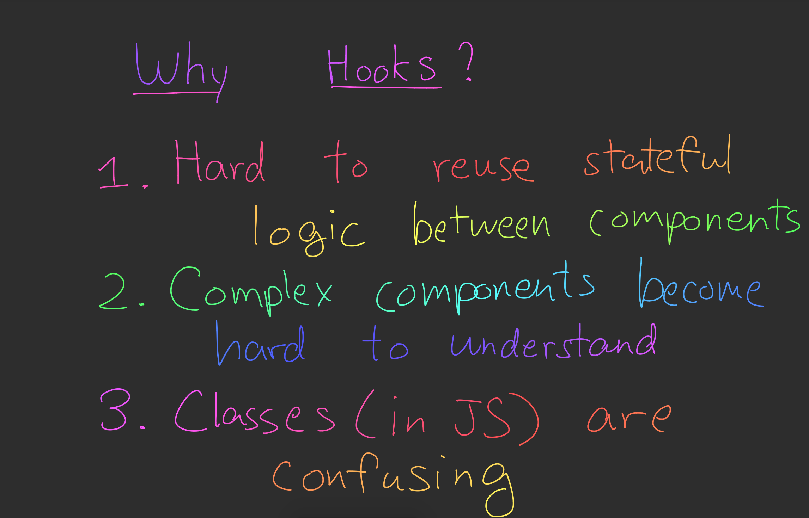
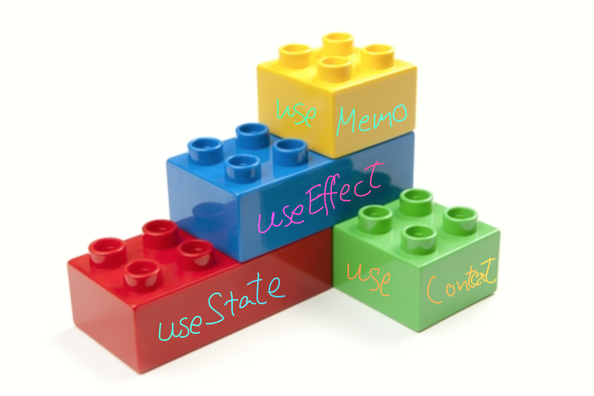

# React Hooks Examples

## Get this Code

* clone it
* `cd hooks-play`
* `yarn install`
* in separate terminal tab: `npm run server`
* back in first terminal tab: `yarn start`

## Why?

## How They Work - React Rendering Loop

## Building Blocks

* built-in hooks are like the lego blocks
* custom hooks are composite building blocks

## Comparisons to Angular

## Basic Hooks Examples

* You can find the various examples under the [src/ex folder](src/ex).

## Recommended Reading

* The [official docs](https://reactjs.org/docs/hooks-intro.html) for Hooks
* The [Hooks reference](https://reactjs.org/docs/hooks-reference.html)
* The [Hooks FAQ](https://reactjs.org/docs/hooks-faq.html)